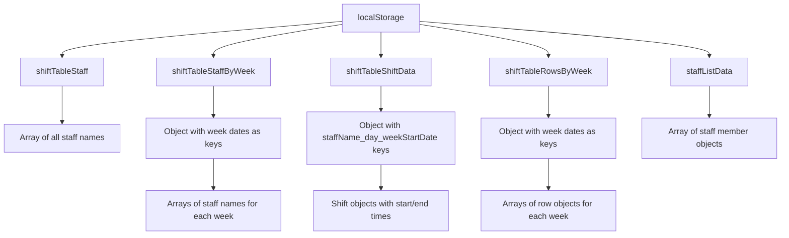
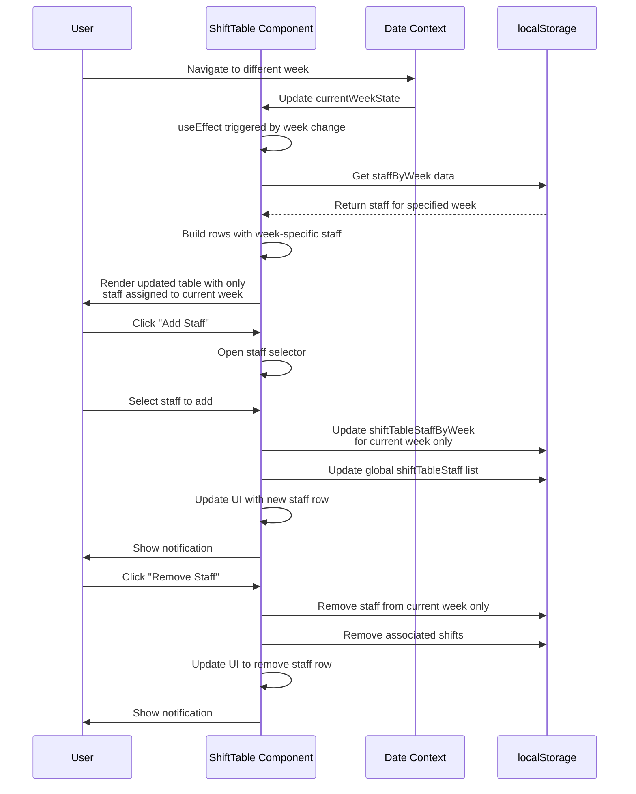
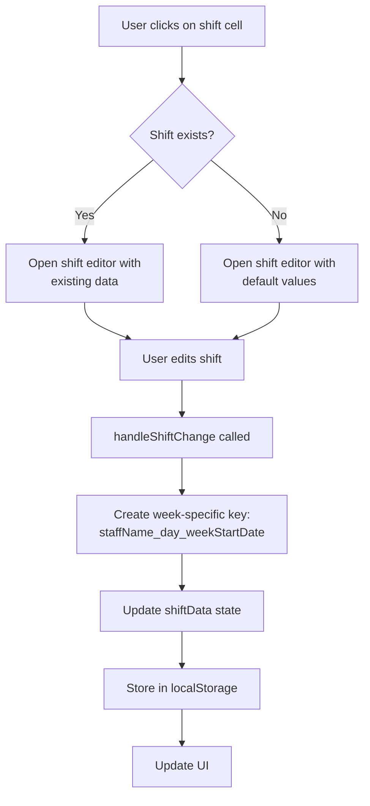
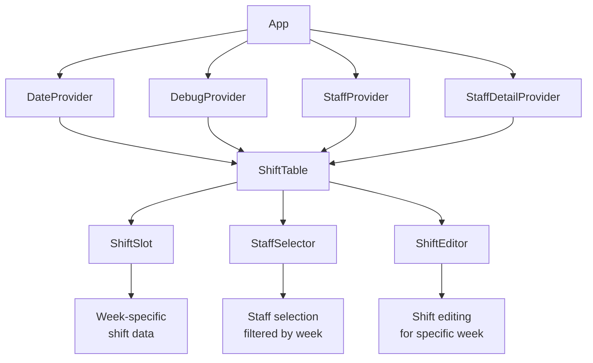

# Make-Rotas Data Flow Diagram (March 15, 2025)

This document outlines the data flow in the Make-Rotas application, with special focus on the week-specific staff assignment implementation.

## Core Data Entities

- **Staff Member**: Individual staff data with properties like `staffID`, `fullName`, `role`, `comments`, `availability`, `inList`, and `state`.
- **Week-Specific Staff**: Staff assigned to specific weeks by their start date.
- **Shift Data**: Represents shifts in the ShiftTable, linked to specific staff members and weeks.
- **Debug Variables**: Dynamic collection of component-specific states for development.

## Data Storage Structure



## Week-Specific Staff Flow



## Shift Data Flow



## Component Hierarchy and Data Flow



## Improved Week-Specific Implementation

The core improvement to the data structure is the separation of staff assignments by week. This is achieved through several key mechanisms:

1. **Week-Specific Staff Storage**:
   - Staff assignments are stored in `shiftTableStaffByWeek` as an object with week start dates as keys
   - Each key contains an array of staff names assigned to that specific week

2. **Direct Week Navigation Updates**:
   - When changing weeks, the component directly loads only staff for that week
   - Each row is explicitly tagged with `weekStartDate` to maintain week association

3. **Isolated Staff Operations**:
   - Adding staff only affects the current week's data
   - Removing staff only removes them from the current week
   - Shift data is linked to specific weeks through composite keys

4. **Week-Specific Key Format**:
   - Shift data uses keys in the format `staffName_day_weekStartDate`
   - This ensures shifts are only visible in their assigned week

## Debug and Error Handling

The application includes detailed logging and error handling:

```javascript
try {
  // Get staff for this specific week
  const staffByWeek = JSON.parse(localStorage.getItem('shiftTableStaffByWeek') || '{}');
  const staffForThisWeek = staffByWeek[weekStartDate] || [];
  
  console.log('📊 DIRECT WEEK UPDATE: Found staff for this week:', {
    week: weekStartDate,
    staffCount: staffForThisWeek.length,
    staff: staffForThisWeek
  });
  
  // Process and render staff...
} catch (error) {
  console.error('❌ DIRECT WEEK UPDATE: Error loading staff for week:', error);
  // Fallback to clean slate...
}
```

This approach ensures that the application maintains a clear separation of staff assignments by week, preventing staff from appearing in weeks they shouldn't be in.
