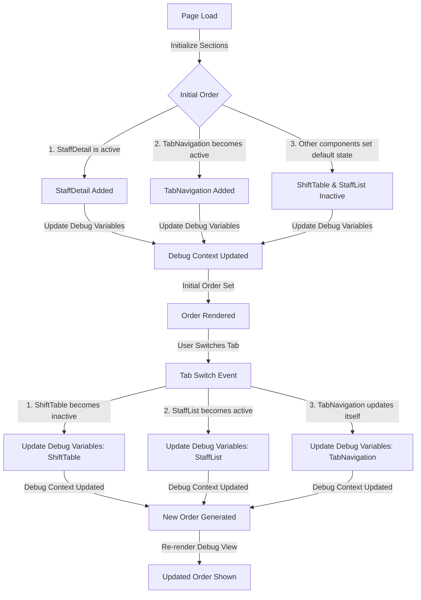

# Debug View Section Ordering

This document explains the behavior of section ordering within the Debug View system, along with a Mermaid graph that illustrates the chronological flow of data.

---

## **Chronological Data Flow**

The Debug View dynamically updates the order of sections based on activity. Here's the sequence:

1. **Page Load:**
   - Sections are initialized with a default order.
   - Example: Staff Details (Active), Tab Navigation (Active), Staff List (Inactive), Shift Table (Active).

2. **User Interaction (e.g., Tab Switch):**
   - Active and inactive statuses of sections change.
   - Components update the Debug Context to reflect their new states.

3. **Order Updates:**
   - The Debug Context processes these updates and adjusts the section order accordingly.

4. **Rendering Updated Order:**
   - The system re-renders the Debug View with the updated section order.

---

## **Mermaid Graph: Chronological Data Flow**

---

### **Explanation of the Graph**

- **Start at Page Load:**
  - Sections are initialized in their default states.

- **Follow the Arrows:**
  - Each step shows how updates occur in the Debug Context and how they affect the section order.

- **Tab Switches:**
  - User actions trigger changes in the Debug Context, marking sections as active or inactive.

- **Final Step:**
  - The Debug View re-renders with the updated section order, reflecting the latest activity.

---

This graph and explanation provide a visual and conceptual understanding of how data flows through the Debug View system, ensuring clarity in the behavior of section ordering.
