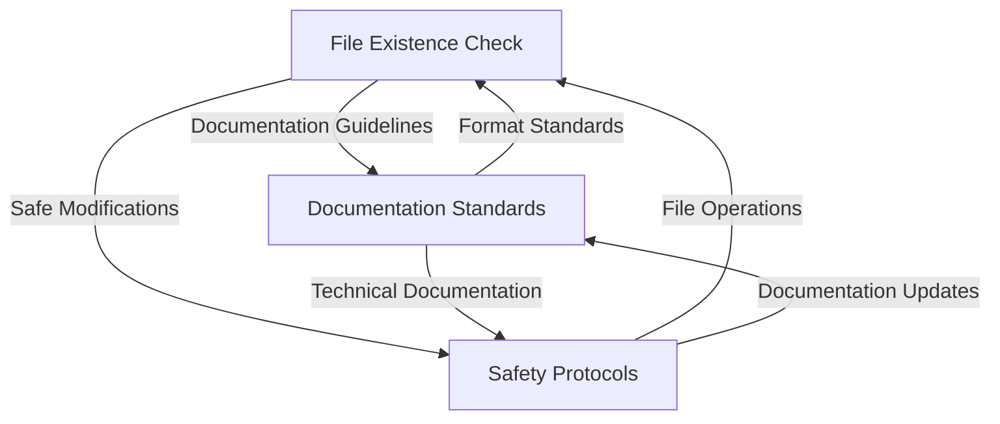

# Memory System Changes Documentation

## Memory Evolution - 2025-01-26

### Overview
This document tracks the evolution and changes made to the system's memory framework, ensuring transparency and traceability in how our AI assistant's memory system develops.

### Memory Creation and Updates

#### 1. File Existence Check Before Writing
**Memory ID:** 52d054e0-6890-4bc0-a863-5bd9cdbee1b0
**Initial Creation:** 2025-01-26 00:00:25Z
**Last Update:** 2025-01-26 00:38:33Z

**Changes Made:**
1. Initial Creation:
   - Basic file management guidelines
   - Documentation file handling
   - Error prevention measures

2. First Enhancement:
   - Added detailed steps for each process
   - Expanded error prevention section
   - Added comprehensive review process

3. Cross-Reference Update:
   - Added references to Documentation Standards
   - Added references to Safety Protocols
   - Added Related Memories section

#### 2. Documentation Structure and Standards
**Memory ID:** 688f38ec-08c3-4b3b-80d0-1bb4927046d5
**Initial Creation:** 2025-01-26 00:05:10Z
**Last Update:** 2025-01-26 00:38:33Z

**Changes Made:**
1. Initial Creation:
   - File organization structure
   - Entry format templates
   - Style guidelines
   - Quality standards

2. Cross-Reference Update:
   - Added references to File Management
   - Added references to Safety Protocols
   - Added Related Memories section
   - Enhanced technical details section

#### 3. Code Change Safety Protocols
**Memory ID:** a2a8a6f3-acec-4bbf-93fd-18971e636b2b
**Initial Creation:** 2025-01-26 00:05:10Z
**Last Update:** 2025-01-26 00:38:33Z

**Changes Made:**
1. Initial Creation:
   - Pre-change analysis steps
   - Implementation guidelines
   - Verification procedures
   - Safety checks
   - Review checklist

2. Cross-Reference Update:
   - Added references to File Management
   - Added references to Documentation Standards
   - Added Related Memories section

### Memory Relationships

### Impact Analysis

1. **Documentation Improvements**
   - More consistent file handling
   - Better cross-referencing
   - Clearer documentation structure

2. **Safety Enhancements**
   - Stronger error prevention
   - Better change management
   - Improved quality control

3. **System Integration**
   - Better memory interconnection
   - More cohesive guidelines
   - Enhanced traceability

### Future Considerations

1. **Potential Enhancements**
   - Add more specific examples
   - Create memory visualization tools
   - Implement automated checks

2. **Monitoring Needs**
   - Track memory effectiveness
   - Monitor cross-reference accuracy
   - Evaluate guideline compliance

### Related Documentation
- `bugs_fixes.md`: For tracking implementation issues
- `feature.md`: For feature documentation
- `accidental_duplication.md`: For preventing duplicates
