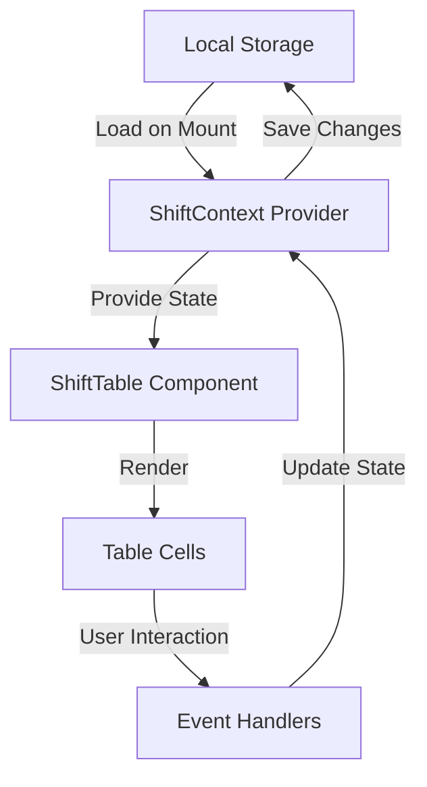

# ShiftTable Component Documentation

## 1. Data Structure & Storage

### Local Storage Keys
```javascript
const STORAGE_KEYS = {
  SHIFTS: 'make_rotas_shifts',
  STAFF: 'make_rotas_staff',
  PREFERENCES: 'make_rotas_preferences'
};
```

### Data Models

#### Shift Model
```javascript
type Shift = {
  id: string;
  staffId: string;
  day: string;
  startTime: string;
  endTime: string;
  notes?: string;
  lastModified: number;
};
```

#### Staff Model
```javascript
type Staff = {
  id: string;
  name: string;
  role: string;
  preferences?: ShiftPreference[];
};
```

## 2. Local Storage Functions

### Save Functions
```javascript
const saveShifts = (shifts: Shift[]) => {
  localStorage.setItem(STORAGE_KEYS.SHIFTS, JSON.stringify(shifts));
};

const saveStaff = (staff: Staff[]) => {
  localStorage.setItem(STORAGE_KEYS.STAFF, JSON.stringify(staff));
};
```

### Load Functions
```javascript
const loadShifts = (): Shift[] => {
  const saved = localStorage.getItem(STORAGE_KEYS.SHIFTS);
  return saved ? JSON.parse(saved) : [];
};

const loadStaff = (): Staff[] => {
  const saved = localStorage.getItem(STORAGE_KEYS.STAFF);
  return saved ? JSON.parse(saved) : [];
};
```

## 3. State Management

### Context Provider Setup
```javascript
const ShiftContext = React.createContext({
  shifts: [],
  staff: [],
  updateShift: (shift: Shift) => {},
  deleteShift: (shiftId: string) => {},
  addStaff: (staff: Staff) => {},
  removeStaff: (staffId: string) => {},
});
```

### Recovery Functions
```javascript
const recoverState = () => {
  const shifts = loadShifts();
  const staff = loadStaff();
  return { shifts, staff };
};
```

## 4. Table Structure & Layout

### Container Architecture
The table uses a nested container structure for enhanced functionality:

```jsx
<div className="mt-4 relative">
  {/* Outer container */}
  <div className="overflow-x-auto border rounded-lg shadow-sm bg-white">
    {/* Inner container */}
    <table>
      {/* Table content */}
    </table>
  </div>
</div>
```

#### Container Roles
1. **Outer Container**
   - Spacing and positioning
   - Sticky element context
   - Document flow maintenance

2. **Inner Container**
   - Horizontal scrolling
   - Visual styling
   - Overflow management

### Week Display System

#### WeekDays Data Structure
```typescript
interface DayInfo {
  date: string;        // YYYY-MM-DD format
  week: number;        // Week offset
  isCurrentWeek: boolean;
  dayName: string;     // Full day name
}

interface WeekDays {
  monday: DayInfo;
  tuesday: DayInfo;
  wednesday: DayInfo;
  thursday: DayInfo;
  friday: DayInfo;
  saturday: DayInfo;
  sunday: DayInfo;
}
```

#### Header Cell Format
```jsx
// Each header cell displays
`${dayName}\n${date}`  // e.g., "Monday\n2025-01-26"
```

#### State Management
- Uses `useMemo` for efficient updates
- Automatically updates with week navigation
- Maintains debug information
- Preserves current week status

### Responsive Design
- Horizontal scrolling for wide tables
- Sticky headers and first column
- Consistent styling across viewports
- Proper overflow handling

## 5. Date Management

### DateContext Integration
```javascript
import { useDate } from '../context/DateContext';

function ShiftTable() {
  const { currentDate, getCurrentMonday } = useDate();
  
  // Initialize with Monday of current week
  const [currentWeek, setCurrentWeek] = useState(() => {
    const mondayDate = getCurrentMonday();
    return {
      id: mondayDate,
      startDate: new Date(mondayDate)
    };
  });
}
```

### Week Management

#### Week Start Rules
- Weeks always start on Monday
- The `getCurrentMonday` function from DateContext handles this automatically
- Adjusts for Sunday being day 0 in JavaScript's Date

#### Week Navigation
```javascript
const navigateWeek = (direction: 'next' | 'previous') => {
  const newDate = new Date(currentWeek.startDate);
  // Add or subtract 7 days while maintaining Monday start
  newDate.setDate(newDate.getDate() + (direction === 'next' ? 7 : -7));
  
  setCurrentWeek({
    id: newDate.toISOString().split('T')[0],
    startDate: newDate
  });
};
```

### Date-Related Functions

#### Current Day Highlighting
```javascript
const isCurrentDay = (date: string) => {
  return date === currentDate;
};
```

#### Shift Date Validation
```javascript
const validateShiftDate = (shift: Shift) => {
  // Ensure shift date is properly formatted
  return shift.day === currentDate || new Date(shift.day) >= new Date(currentDate);
};
```

### Benefits
1. **Real-time Updates**
   - Table updates automatically at midnight
   - Current day highlighting stays accurate
   - No manual refresh needed

2. **Data Consistency**
   - All date operations use same source
   - Prevents date mismatches
   - Simplifies date-based logic

## 6. Error Handling

### Recovery Procedures
1. Check for corrupted data on load
2. Maintain backup in session storage
3. Log errors to console
4. Show user-friendly error messages

## 7. Performance Considerations

### Optimization Techniques
1. Use React.memo for cell components
2. Implement virtualization for large datasets
3. Batch local storage updates
4. Use debounced save functions

## 8. Accessibility Features

### ARIA Attributes
```javascript
const ariaLabels = {
  table: 'Shift schedule table',
  cell: 'Shift cell for {staff} on {day}',
  editButton: 'Edit shift for {staff}',
  deleteButton: 'Delete shift for {staff}'
};
```

## 9. Usage Example

```javascript
function App() {
  return (
    <ShiftProvider>
      <ShiftTable />
    </ShiftProvider>
  );
}
```

## 10. Browser Support

The component uses:
- localStorage API
- CSS Grid/Flexbox
- Position: sticky
- Modern JavaScript features

Ensure polyfills are included for older browsers.

## 11. Data Flow

### Overview


### Detailed Flow Description

1. **Initial Load**
   - Application starts
   - ShiftContext Provider initializes
   - Load data from localStorage
   - Populate initial state
   - Render ShiftTable

2. **State Updates**
   ```
   User Action → Event Handler → Context Update → State Change → Re-render → localStorage Update
   ```

3. **Data Persistence Cycle**
   - User makes changes
   - Debounced save to localStorage
   - Automatic recovery on page refresh
   - Backup in sessionStorage

4. **Error Recovery Flow**
   ```
   Error Detected → Load Backup → Restore State → Log Error → Notify User
   ```

### Component Communication

```javascript
// Parent to Child Flow
ShiftProvider
  └─ ShiftTable
     └─ ShiftRow
        └─ ShiftCell
           └─ ShiftEditor

// Event Bubbling
ShiftEditor → ShiftCell → ShiftRow → ShiftTable → ShiftProvider
```

### State Update Sequence

1. **User Interaction**
   ```
   Click → handleShiftClick → openEditor
   ```

2. **Data Modification**
   ```
   Edit → validateInput → updateState → triggerSave
   ```

3. **Storage Sync**
   ```
   State Change → Debounce → Save → Confirm
   ```

### Recovery Mechanisms

1. **Browser Refresh**
   ```
   Page Load → Check localStorage → Validate Data → Restore State
   ```

2. **Error Recovery**
   ```
   Error → Check Backup → Restore → Reset → Continue
   ```

## 12. Variables and State Management

### Context Variables
```javascript
// ShiftContext Provider State
const [shifts, setShifts] = useState<Shift[]>([]);
const [staff, setStaff] = useState<Staff[]>([]);
const [preferences, setPreferences] = useState(DEFAULT_STATE.preferences);
const [isLoading, setIsLoading] = useState(true);
const [error, setError] = useState<Error | null>(null);
```

### Local Storage Variables
```javascript
// Storage Keys
const STORAGE_KEYS = {
  SHIFTS: 'make_rotas_shifts',
  STAFF: 'make_rotas_staff',
  PREFERENCES: 'make_rotas_preferences',
  BACKUP: 'make_rotas_backup'
};

// Backup Data
const backupData = {
  timestamp: number,
  shifts: Shift[],
  staff: Staff[],
  preferences: Preferences
};
```

### Component State Variables
```javascript
// ShiftTable Component
const [activeCell, setActiveCell] = useState<string | null>(null);
const [editingShift, setEditingShift] = useState<Shift | null>(null);
const [isEditorOpen, setIsEditorOpen] = useState(false);
const [hoveredCell, setHoveredCell] = useState<string | null>(null);

// ShiftEditor Component
const [startTime, setStartTime] = useState(shift?.startTime || '');
const [endTime, setEndTime] = useState(shift?.endTime || '');
const [notes, setNotes] = useState(shift?.notes || '');
const [validation, setValidation] = useState({ isValid: true, message: '' });
```

### Utility Variables
```javascript
// Debounce Timer
const saveDebounceTimeout = useRef<NodeJS.Timeout>();

// Memoized Values
const sortedShifts = useMemo(() => sortShiftsByDate(shifts), [shifts]);
const staffMap = useMemo(() => createStaffMap(staff), [staff]);

// Event Handlers
const debouncedSave = useCallback(debounce(saveToStorage, 1000), []);
const handleCellClick = useCallback((cellId: string) => {}, []);
```

### Constants and Configuration
```javascript
const DEFAULT_STATE = {
  preferences: {
    weekStartDay: 'Monday',
    timeFormat: '24h',
    showWeekends: true,
    autoSave: true
  }
};

const VALIDATION_RULES = {
  minShiftLength: 30, // minutes
  maxShiftLength: 720, // minutes
  maxShiftsPerDay: 2
};

const UI_CONSTANTS = {
  cellWidth: 100,
  cellHeight: 60,
  headerHeight: 40,
  scrollBuffer: 20
};
```

### Error and Recovery Variables
```javascript
const errorStates = {
  STORAGE_ERROR: 'storage_error',
  VALIDATION_ERROR: 'validation_error',
  NETWORK_ERROR: 'network_error',
  DATA_CORRUPTION: 'data_corruption'
};

const recoveryModes = {
  RESTORE_BACKUP: 'restore_backup',
  RESET_STATE: 'reset_state',
  MERGE_CONFLICTS: 'merge_conflicts'
};
```

### Performance Optimization Variables
```javascript
// Virtual Scrolling
const virtualizedItems = useVirtualizer({
  count: totalRows,
  getScrollElement: () => scrollElementRef.current,
  estimateSize: () => UI_CONSTANTS.cellHeight
});

// Intersection Observer
const observerOptions = {
  root: null,
  rootMargin: '20px',
  threshold: 0.1
};
```

## 13. Week Management System

### Core Concepts

1. **Week Identification**
```javascript
// Each week needs a unique identifier and metadata
type Week = {
  id: string;              // Unique identifier for the week
  startDate: Date;         // Start date of the week
  endDate: Date;          // End date of the week
  isFavorited: boolean;    // Whether user has favorited this week
  lastAccessed: Date;      // Last time this week was viewed
  lastModified: Date;      // Last time shifts were modified in this week
};
```

2. **Storage Structure**
```javascript
// Local storage structure for weeks
type WeekStorage = {
  activeWeek: string;      // Currently viewed week ID
  weeks: {                 // Map of all stored weeks
    [weekId: string]: Week
  };
  favorites: string[];     // List of favorited week IDs
  shifts: {               // Shifts organized by week
    [weekId: string]: Shift[]
  };
};
```

### Data Flow Stages

1. **Week Navigation System**
```javascript
// Variables for week navigation
const weekManagement = {
  // Current view state
  currentWeekId: string,
  visibleWeekRange: Date[],
  
  // Configuration
  maxStoredWeeks: number,        // Maximum non-favorited weeks to store
  retentionPeriodDays: number,   // Days to keep non-favorited weeks
  cleanupThreshold: number,      // Trigger cleanup when exceeding this number
};
```

2. **Week Lifecycle Management**
```javascript
// Week state transitions
type WeekStatus = {
  ACTIVE: 'active',         // Currently viewed
  RECENT: 'recent',         // Viewed/modified within retention period
  FAVORITE: 'favorite',     // User-marked as favorite
  EXPIRED: 'expired'        // Beyond retention period, not favorited
};

// Cleanup configuration
type CleanupConfig = {
  maxWeeks: number,
  retentionDays: number,
  checkFrequency: number    // How often to run cleanup (in hours)
};
```

### Key Functions and Their Purposes

1. **Week Navigation**
```javascript
// Functions for navigating between weeks
const weekNavigation = {
  // Move to next/previous week
  navigateWeek: (direction: 'next' | 'previous') => void,
  
  // Jump to specific week
  jumpToWeek: (date: Date) => void,
  
  // Update week view when navigating
  updateWeekView: (weekId: string) => void
};
```

2. **Storage Management**
```javascript
// Functions for managing stored weeks
const storageManagement = {
  // Save week data
  saveWeek: (weekData: Week) => void,
  
  // Mark week as favorite
  toggleFavorite: (weekId: string) => void,
  
  // Clean up old weeks
  cleanupExpiredWeeks: () => void
};
```

3. **Automatic Cleanup Process**
```javascript
// Cleanup workflow
const cleanupProcess = {
  // Check if cleanup is needed
  shouldRunCleanup: () => boolean,
  
  // Identify weeks for removal
  getExpiredWeeks: () => string[],
  
  // Remove expired weeks
  removeExpiredWeeks: (weekIds: string[]) => void
};
```

### Event Flow

1. **User Navigation**
```
User Action → Update Active Week → Load Week Data → Update View → Record Access Time
```

2. **Favoriting**
```
User Favorites Week → Update Storage → Exclude from Cleanup → Update UI
```

3. **Cleanup Trigger**
```
Storage Check → Identify Expired → Confirm Non-Favorite → Remove → Update Storage
```

### Storage Optimization

1. **Cleanup Triggers**
```javascript
// When cleanup should run
const cleanupTriggers = {
  EXCEED_MAX_WEEKS: 'exceed_max_weeks',
  TIME_THRESHOLD: 'time_threshold',
  STORAGE_LIMIT: 'storage_limit',
  MANUAL: 'manual'
};
```

2. **Priority System**
```javascript
// How to prioritize week retention
const retentionPriority = {
  FAVORITE: 3,          // Never remove
  RECENT_MODIFIED: 2,   // Keep unless storage critical
  RECENT_VIEWED: 1,     // Remove if needed
  EXPIRED: 0           // Remove first
};
```

### User Experience Considerations

1. **Notifications**
```javascript
// User notifications for week management
const weekNotifications = {
  CLEANUP_SCHEDULED: 'Older weeks will be removed soon',
  FAVORITE_PROMPT: 'Favorite this week to keep it permanently',
  STORAGE_WARNING: 'Storage space running low'
};
```

2. **Recovery Options**
```javascript
// Recovery mechanisms
const weekRecovery = {
  BACKUP_FAVORITES: true,
  EXPORT_BEFORE_CLEANUP: true,
  RESTORE_POINT_DAYS: 7
};
```